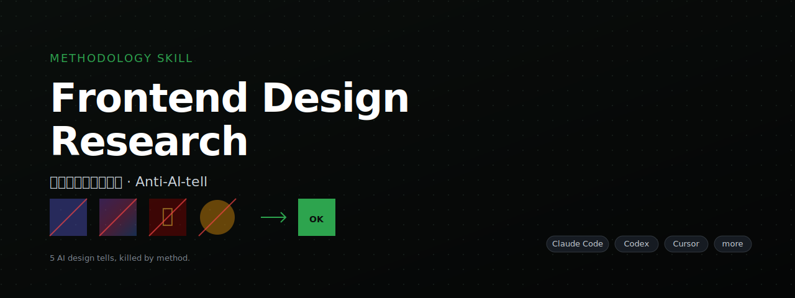
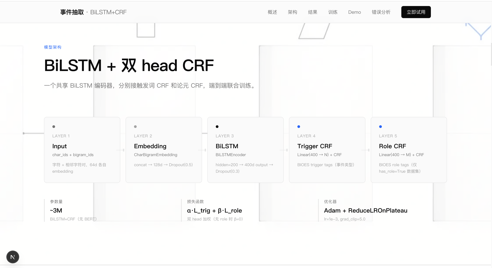

<p align="center">
  <a href="https://github.com/0505ttt/frontend-design-research-zh">
    
  </a>
</p>

# Frontend Design Research

A methodology skill that makes AI-generated frontends stop looking AI-generated. Forces three cross-referenced documents and exposes the root cause of every "AI design tell."

English · [中文](./README.md)

---

## Quickstart

Install it on whichever agent you use: [Claude Code](#claude-code) · [Codex](#codex) · [Cursor](#cursor) · [Other agents](#other-agents)

## How it works

It starts the moment you say "design a frontend for my project." Unlike the default AI that jumps straight into writing code, it first asks you about the project type, target audience, aesthetic preference, and — most importantly — what kind of websites you dislike.

Then it walks through five well-documented "AI design tells": purple gradients, cultural clichés, mesh gradients, cartoon mascots, and SaaS template feel. Each one comes with a **root cause** — for example, the purple bias comes from Tailwind's default `bg-indigo-500` polluting training data — not just a hand-wave that "this looks bad."

After that it produces three cross-referenced documents:

1. **Design research** — colors, typography, page structure, motion, benchmark sites
2. **Image prompts** — one prompt per asset, each with anti-tell negative keywords
3. **Implementation plan** — tech stack, API design, component inventory, phased schedule

If you're going to ship with v0 / bolt / lovable, it also produces compressed prompts for those tools — because pasting three full documents into them doesn't actually work.

The whole flow runs through 12 phases, each with a checkable checklist. Tight-budget projects can take the Tier 0 fast path (a single `design.md` in under 2 hours).

---

## Installation

### Claude Code

```bash
/plugin marketplace add 0505ttt/frontend-design-research-zh
/plugin install frontend-design-research-zh@frontend-design-research-zh
```

### Codex

Copy `SKILL.md` from this repo into Codex's skills directory, or reference the raw URL in Codex Desktop custom instructions:

```
https://raw.githubusercontent.com/0505ttt/frontend-design-research-zh/main/SKILL.md
```

### Cursor

Paste the contents of `SKILL.md` into `.cursor/rules/frontend-design.md`, or reference it from Cursor's Custom Instructions.

### Other agents

WindSurf / Cline / Continue / Aider / Gemini CLI / GitHub Copilot — universal approach: paste `SKILL.md` into the tool's rules / system prompt / custom instructions. No modification needed. It's just structured methodology markdown — any agent that reads markdown can use it.

---

## Examples




---

## What's inside

- `SKILL.md` — main methodology (17 chapters / 12 phases / Tier 0 fast path)
- `references/anti-ai-patterns.md` — full anti-tell checklist with root causes
- `references/ai-image-cn.md` — Chinese AI image tools (Jimeng / Tongyi Wanxiang / Kling / Doubao + Codex orchestration)
- `references/ai-builder-prompts.md` — v0 / bolt / lovable prompt templates

---

## Philosophy

**Method, not aesthetics.** Specific color / typography / style decisions are driven by your dislikes and real-world benchmarks. The AI doesn't fill in the blanks for you.

**Anti-AI-tells have root causes, not vibes.** The purple bias exists because Tailwind's default colors polluted training data ([AITNT](https://m.aitntnews.com/newDetail.html?newId=17685) · [Volcengine](https://developer.volcengine.com/articles/7537170135619600426) · [@dotey](https://x.com/dotey/status/1953714406220554279)). This skill writes down the root cause for every tell, so the fix maps to a verifiable code change — like "delete `colors.indigo` from `tailwind.config`" — instead of "try a different feeling."

**Multi-tool collaboration is the default path, not an add-on.** The three documents aren't just for Claude Code. They get further compressed into prompts that v0 / bolt / lovable / Cursor can actually consume.

---

## Contributing

Issues and PRs welcome: extend the anti-tell checklist, add new language versions, review new Chinese AI image tools, share new feedback-classification strategies.

## License

[MIT](./LICENSE)
