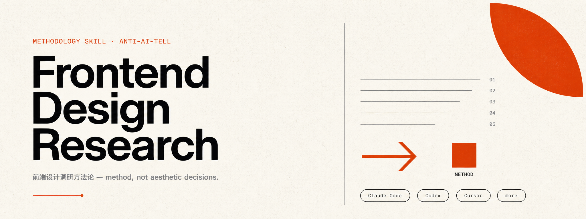
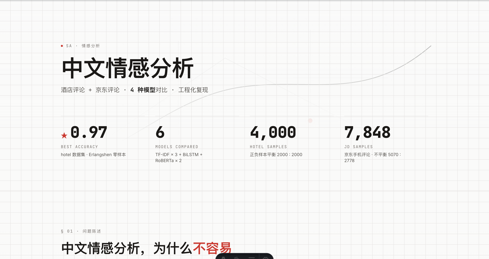
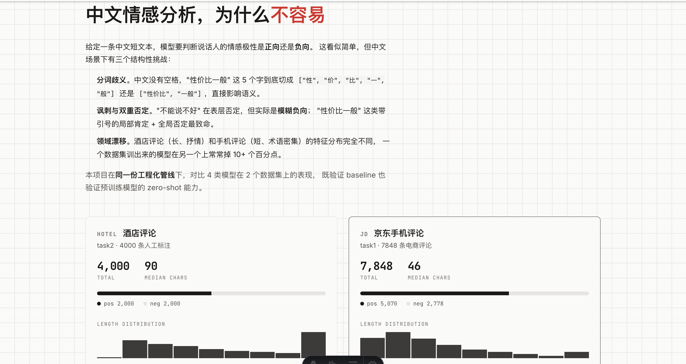

<p align="center">
  <a href="https://github.com/0505ttt/frontend-design-research-zh">
    
  </a>
</p>

# 前端设计调研方法论

让 AI 帮你做前端设计调研时，主动避开 5 类「AI 味」陷阱，并强制输出三份相互引用的文档。

<p align="center">
  <a href="./LICENSE"></a>
  <a href="./.github/banner-prompt.md"></a>
  <a href="https://github.com/0505ttt/frontend-design-research-zh/stargazers"></a>
  <a href="https://github.com/0505ttt/frontend-design-research-zh/issues"></a>
  <a href="https://github.com/0505ttt/frontend-design-research-zh/pulls"></a>
  <a href="https://x.com/xyun023"></a>
</p>

[English](./README.en.md) · 中文

---

## Quickstart

把它装到你常用的 agent 上：[Claude Code](#claude-code) · [Codex](#codex) · [Cursor](#cursor) · [其他 agent](#其他-agent)

## How it works

它从你说「为我的项目设计个前端」那一刻开始工作。不像默认 AI 直接跳进写代码——它会先问清楚你的项目类型、目标受众、审美倾向，以及你最不喜欢什么样的网站。

然后把项目里的「AI 设计陷阱」逐个标出来：紫色调、文化主题、mesh gradient、Q 版吉祥物、SaaS 模板感。每个陷阱都附**根因**——比如紫色调是因为 Tailwind 默认 `bg-indigo-500` 污染了训练数据——而不只是说「这个不好看」。

接着它会按方法论输出三份相互引用的文档：

1. **设计研究** — 配色、字体、页面结构、动效、对标网站
2. **生图提示词** — 每张图的 prompt + 反陷阱负面词
3. **实施 plan** — 技术栈、API 设计、组件清单、阶段计划

如果用 v0 / bolt / lovable 落地，它会顺便产出「喂给这些工具的压缩 prompt」——因为直接贴三份完整文档，它们读不进去。

整个过程按 12 个 Phase 推进，每个 Phase 都有可勾选的 checklist。预算不够的项目可以走 Tier 0 快速路径（< 2 小时只出一份 `design.md`）。

---

## Installation

### Claude Code

```bash
/plugin marketplace add 0505ttt/frontend-design-research-zh
/plugin install frontend-design-research-zh@frontend-design-research-zh
```

### Codex

把仓库里的 `SKILL.md` 复制到 Codex 的 skills 目录，或在 Codex Desktop 的自定义指令里引用 raw URL：

```
https://raw.githubusercontent.com/0505ttt/frontend-design-research-zh/main/SKILL.md
```

### Cursor

把 `SKILL.md` 内容粘到 `.cursor/rules/frontend-design.md`，或在 Cursor 的 Custom Instructions 里引用。

### 其他 agent

WindSurf / Cline / Continue / Aider / Gemini CLI / GitHub Copilot 通用做法：把 `SKILL.md` 内容粘到该工具的 rules / system prompt / custom instructions 里，无需任何修改。本质是一份结构化方法论 markdown，任何能读 markdown 的 agent 都能用。

---

## Examples






---

## What's inside

- `SKILL.md` — 主方法论（17 章 / 12 个 Phase / Tier 0 快速路径）
- `references/anti-ai-patterns.md` — 反陷阱完整清单 + 根因
- `references/ai-image-cn.md` — 中文 AI 生图工具（即梦 / 通义万相 / 可灵 / 豆包 + Codex 工程化）
- `references/ai-builder-prompts.md` — v0 / bolt / lovable 喂养 prompt 模板

---

## Philosophy

**教方法，不教审美。** 具体配色 / 字体 / 风格决策由你提供反例 + 真实对标驱动，AI 不替你填空。

**反 AI 味是有根因的，不是玄学。** 紫色调是因为 Tailwind 默认色污染训练数据（[AITNT](https://m.aitntnews.com/newDetail.html?newId=17685) · [火山引擎](https://developer.volcengine.com/articles/7537170135619600426) · [@dotey](https://x.com/dotey/status/1953714406220554279)）。本 skill 把每个陷阱的根因都写出来，让对策落到可验证的代码改动上——比如「在 `tailwind.config` 里删 `colors.indigo`」——而不是「换个感觉」。

**多工具协作是默认路径，不是补充。** 三份文档不只是给 Claude Code 用，它们会被进一步压缩成 v0 / bolt / lovable / Cursor 能消费的 prompt。

---

## Contributing

欢迎提 Issue / PR：补充陷阱清单、加新语言版本、加新的中文 AI 生图工具评测、分享新的反馈分类策略。

## License

[MIT](./LICENSE)
